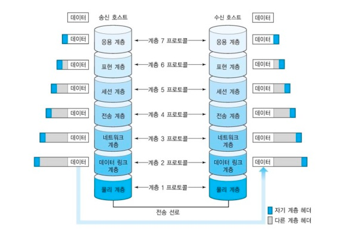

# OSI 7계층

**Open Systems Interconnection Reference Model 7 Layer** (개방형 시스템 상호연결 참조모델 7계층) 으로, 국제 표준화 기구 (ISO) 에서 개발한 통신에 관한 계층화 표준 모델이다.  

###### 이미지출처 : http://wiki.hash.kr/index.php/%ED%8C%8C%EC%9D%BC:OSI_7_%EA%B3%84%EC%B8%B5.jpg

## More...

- 2계층
    - MAC address (로컬에서만 인지가능/원격에서 인지 불가)
- 3계층
    - IP (Internet protocol) address
- 4계층
    - TCP, UDP => Port number

**=> IP address 를 통해 기기를 특정하고, Port 를 통해 프로그램을 특정한다.**

- 7계층
    - 응용 계층 => HTTP 등
        - HTTPS 를 위한 TLS 같은 보안계층이 먼저 들어갈수도 있다.
