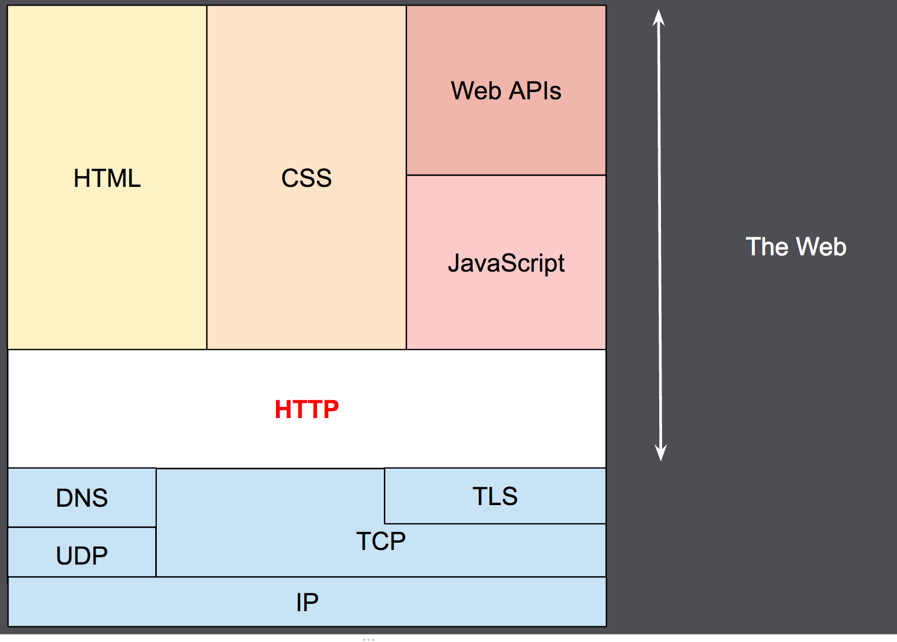
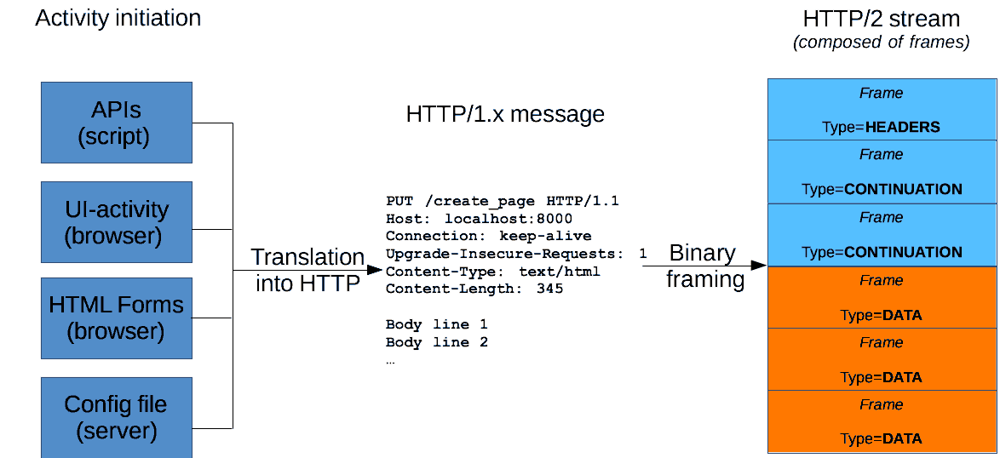

# HTTP 의 이해

## HTTP 의 사전적의미
Hypertext transfer Protocl 의 약어로, HTML과 같은 [하이퍼미디어](#하이퍼미디어) 문서를 전송하기 위한 [애플리케이션 계층](#애플리케이션-계층) 프로토콜이다.
웹 브라우저와 웹 서버간의 통신을 위해 설계되었으나, 다른 목적으로도 사용될 수 있다.  
클라이언트가 요청을 하기 위해 연결을 연 다음 응답을 받을때 까지 대기하는 전통적인 [클라이언트-서버 모델](#클라이언트-서버-모델) 을 따르며, HTTP 는 [Stateless](#stateless) Protocol 이고, 서버가 두 요청 간에 어떠한 데이터(State) 도 유지하지 않는다.

## HTTP 개요

###### 이미지출처 : https://developer.mozilla.org/ko/docs/Web/HTTP/Overview

우리가 Web 이라 부르는 것은, HTTP 부터 위를 일컫음

## HTTP 메시지
서버와 클라이언트 간에 데이터가 교환되는 방식을 일컫는다.  
**기본적으로는** 사람이 읽을 수 있는 형태이며, 요청과 응답의 구조가 동일하다.


###### 이미지출처 : https://developer.mozilla.org/ko/docs/Web/HTTP/Messages

1. Start line : 요청과 응답의 형태가 다르다.
2. Headers
3. 빈 줄
4. Body (Optional)
   - 크기를 알기 어려움. (Headers 의 Content-Length 항목 등을 활용한다.)
   - 꼭 사람이 읽을 수 있는 텍스트 형태일 필요는 없다.
   - 하나가 아니라 여럴일 수도 있다. 파일 업로드 등을 위해 쓰이는 `multipart/form-data` 가 대표적이다.

### Start line

요청과 응답의 형태가 다르다.  
```markdown
Request Example
POST /me HTTP/1.1

Response Example
HTTP/1.1 201 Created
```
요청에서 쓰이는 것은 [HTTP Method](#http-method) 과 있으며, 응답에서 쓰이는 것은 [HTTP Status Code](#http-status-code) 가 있다.


---
###### 하이퍼미디어
Hypermedia 로, 테드 넬슨이 만든 용어이다.  
그래픽, 오디오, 영상, 완전한 텍스트, 그리고 하이퍼링크가 비선형 매체의 정보를 만들기 위해 모여있는 것을 의미한다.  
월드와이드웹 (www) 이 기본적인 예이며, 상호작용을 하지 않는 영화관의 관념은 하이퍼링크의 부재 때문에 비롯되는 표준 멀티미디어의 예이다.

###### 애플리케이션 계층
OSI 7계층 중 7계층에 해당하는 것으로, 자세한 내용은 [해당 문서](./OSI.md)에서 다루도록 하겠다.

###### 클라이언트-서버 모델
클라이언트는 요청을 하며, 서버는 처리하고 응답을 하는 것이다.  
요청을 할때 서비스나 리소스를 표현하는데 _(음식을 주문할때, `국밥을 주세요` 라고 하는 것과 같이)_, 이를 표현하는 것이 URL 이다.    
`scheme://host:port/path?query#fragment`

###### Stateless
각각의 요청이 독립적이라는 의미이다.  
즉, 클라이언트는 **항상 자신이 누구인지 알려주어야 한다.**

###### HTTP Method
무엇을 하기 원하는지 **표현**한다. 대표적으로는 아래와 같다.
- GET : Read
- POST : Create
- PUT : Update (+Create) => Overwrite 개념으로
- PATCH : Update (partially) => 멱등성 X
- DELETE : Delete

**멱등성** : 요청이 독립적이다, 요청마다 같은 결과를 반환한다.

###### HTTP Status Code
크게 세자리 숫자료 표기하는, 요청에 대한 결과를 반환해주는 값.  
대표적으로는 아래와 같다.  

- 2xx : 성공의 경우 (200 OK, 201 Created, 204 No Content) 
- 4xx : Client 오류 (400 Bad Request, 404 Not Found)
- 5xx : Server 오류 (500 Internal Server Error)
