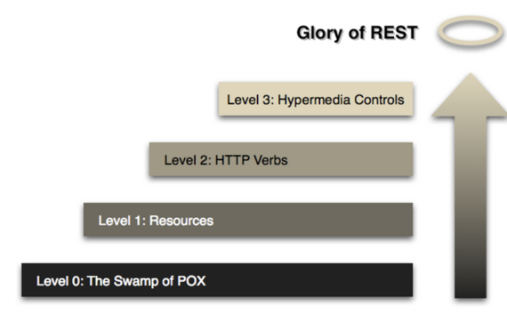

# Richardson Maturity Model (리차드슨 성숙도 모델)



RestAPI 에 이르는 단계를 정의해둔 것이다.

## Level 0: The Swamp of POX (Plain Old XML)

아무것도 안된 상태를 일컫는다. 그냥 개발만 된 상태

## Level 1: Resources

자원을 표현항 상태이다. 이제부터는 URI 에 자원을 표기한다.  
책을 다루는 api 라면 `/books` 와 같이 요청하게 된다.

## Level 2: HTTP Verbs

HTTP Method 를 통해서 표현하게 된다.  
책들을 가지고 올 경우엥는 `GET /books` 와 같이 요청하게 되고, 새로 책을 추가할 경우에는 `POST /books` 와 같이 요청하게 된다.  

## Level 3: Hypermedia Controls

가장 까다로운 부분이고, 잘 지켜지지 않는다.  
다음 행위 같은 것을 할 수 있도록 링크를 통해 제공하는 것을 의미한다.  
가령 전체 책 목록을 요청했다면 그 응답은 아래와 같아져야 한다.

```json
{
  "books": [
    {
      "title": "RESTful Web Services Cookbook",
      "author": "Subbu Allamaraju",
      ...
        "links": [ // <- 이 부분이 Level3 의 조건이 된다.
            {
            "rel": "self",
            "href": "/books/1"
            },
            {
            "rel": "delete",
            "href": "/books/1"
            },
            {
            "rel": "update",
            "href": "/books/1"
            }
        ]
    },
    ...
  ]
}
```
